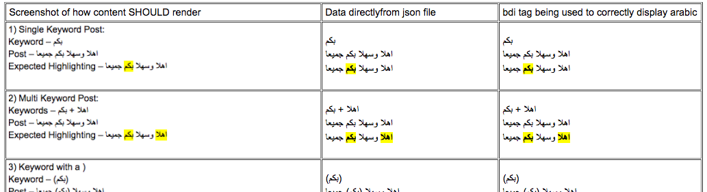

# arabic_highlighting_of_keywords_hashtags_and_mentions
Simple test case showing how to highlight keywords in arabic content and display it correctly

# How to run 
- clone this repo
- cd `arabic_highlighting_of_keywords_hashtags_and_mentions`
- serve the folder over a web server. e.g. `python -m SimpleHTTPServer`
- open the page in your browser, e.g. `http://localhost:8000`
- view the page and compare the results!

This is intended as a starting point for anyone that wants to test highlighting arabic content in their app. They can simply use the `test_data.json` file in their unit tests, and then compare the results visually with what they seen in this page.

There are 31 test cases in the `test_data.json` file. Here's a screenshot of 2 of them.....

LICENSE: MIT

